# AgroSense System Blueprint 

## 🔍 System Overview

AgroSense is an **AI-powered, multi-agent precision agriculture system** built on a **Hierarchical Multi-Agent Architecture** orchestrated by **CrewAI** and served via **FastAPI**. The system integrates **Retrieval-Augmented Generation (RAG)** using **Pinecone** for vector storage and **Cohere embeddings** for semantic similarity, enabling domain-specific agricultural intelligence. Contextual awareness is achieved through the **Model Context Protocol (MCP)**, which ensures consistent and dynamic data sharing among agents, providing region-aware, crop- or livestock-specific insights.

### 🌾 Core Goals

* Deliver **localized**, data-driven agricultural recommendations.
* Integrate **real-time weather and price data** for context-aware decision-making.
* Enable **automated workflows** via n8n for alerting and reporting.
* Maintain a modular, scalable, and API-ready design suitable for enterprise deployment.

### 🧠 Core Technologies

| Layer              | Technology                            | Role                                                          |
| ------------------ | ------------------------------------- | ------------------------------------------------------------- |
| Orchestration      | **CrewAI**                            | Manages and coordinates multiple agents                       |
| Backend API        | **FastAPI**                           | RESTful API for request routing and agent interfacing         |
| Context Management | **Model Context Protocol (MCP)**      | Enables shared contextual memory between agents               |
| Retrieval          | **Pinecone Vector DB**                | Vector-based document retrieval for RAG                       |
| Embeddings         | **Cohere**                            | Semantic embedding generation for document vectors            |
| Frontend           | **Streamlit**                         | Farmer-facing UI for queries and results display              |
| Automation         | **n8n**                               | Triggers alerts or workflows for critical agricultural events |
| Data Sources       | **Local PDFs, Weather & Market APIs** | Provides raw and contextual data                              |

---

## ⚙️ System Flow (Mermaid Diagram)

```mermaid
graph TD
    A[👨‍🌾 User Query via Streamlit UI] -->|Text + Region| B[🌐 FastAPI Router]
    B --> C[🧩 CrewAI Orchestrator Agent]

    subgraph MCP_Context[MCP Context Management]
        D[(🧠 MCP Client)]
        D1[Query Text]
        D2[Region e.g. Nakuru]
        D3[Asset Type Crop/Livestock]
    end

    C -->|Initialize Context| D
    D -->|Stores| D1
    D -->|Stores| D2
    D -->|Stores| D3

    subgraph Agents[Agent Processing]
        E1[📚 Agri-Knowledge Agent]
        E2[🌦️ Weather/Price Agent]
        E3[🧬 Diagnostic Agent]
        E4[⚙️ Action Agent]
    end

    C --> E1
    E1 -->|RAG Search by Asset Type| F1[(🔎 Pinecone Vector DB)]
    F1 -->|Cohere Embeddings + Context| D

    C --> E2
    E2 -->|Region-based API Calls| F2[(☁️ Weather + Market APIs)]
    F2 -->|Regional Data| D

    C --> E3
    E3 -->|Reads from MCP Query Knowledge Regional Data| D
    E3 -->|Generates| G1[💡 Localized Recommendation]
    G1 --> D

    C --> E4
    E4 -->|Checks Critical Conditions| D
    E4 -->|Trigger Alert if Severe| H[(🚨 n8n Workflow Automation)]

    D -->|Final Structured Response| I[🪶 Streamlit UI Output]

    subgraph Storage[Data & Logging]
        L1[📁 Knowledge Base Raw PDFs]
        L2[📊 Pinecone Vector Index]
        L3[🧾 ingest.py ETL & Logging]
    end

    L1 --> L2
    L2 --> F1
    L3 --> L2

    style D fill:#d8f3dc,stroke:#2d6a4f,stroke-width:2px
    style F1 fill:#cdeaff,stroke:#0077b6,stroke-width:2px
    style F2 fill:#fde2e4,stroke:#c1121f,stroke-width:2px
    style G1 fill:#fff3b0,stroke:#ffb703,stroke-width:2px
```

---

## 🧩 Agent Responsibilities Summary

| Agent                    | Responsibility                                             | Tool(s)                 | Writes to MCP             |
| ------------------------ | ---------------------------------------------------------- | ----------------------- | ------------------------- |
| **Orchestrator Agent**   | Classifies intent, identifies asset type, initializes MCP  | None                    | Query, Asset Type, Region |
| **Agri-Knowledge Agent** | Retrieves relevant documents using RAG (Pinecone + Cohere) | `rag_tool.py`           | Retrieved Context         |
| **Weather/Price Agent**  | Fetches real-time localized data                           | `weather_price_tool.py` | Regional Data             |
| **Diagnostic Agent**     | Synthesizes advice using all MCP data                      | Internal logic          | Final Advice              |
| **Action Agent**         | Automates responses for critical alerts                    | `n8n_alert_tool.py`     | Trigger Payload           |

---

## 🧠 Context Management Logic (MCP)

* The **MCP Client** serves as a centralized memory bus.
* It stores: `query`, `asset_type`, `region`, `retrieved_context`, and `regional_data`.
* Each agent reads/writes to the MCP without cross-dependencies, ensuring modularity.
* Context persists throughout the pipeline for multi-step reasoning and transparency.

---

## 🧾 Example Query Flow

> **Farmer Input:** "What is affecting my maize crops in Nakuru?"
>
> **System Steps:**
>
> 1. FastAPI receives query + region.
> 2. Orchestrator identifies asset_type = Crop.
> 3. MCP initialized with query + region.
> 4. RAG fetches relevant maize-related documents.
> 5. Weather/Price Agent collects Nakuru-specific weather data.
> 6. Diagnostic Agent fuses both for a context-aware response.
> 7. If disease outbreak is severe → Action Agent triggers n8n alert.
> 8. Streamlit UI displays final, localized advice to the farmer.

---

✅ **Result:** A scalable, intelligent, and explainable agricultural advisory ecosystem — merging **AI reasoning**, **real-time data**, and **modular multi-agent collaboration** under one cohesive architecture.