# 🌿 AgroSense Technical Documentation

## 1. 🔍 System Overview

**AgroSense** is an **AI-powered, multi-agent precision agriculture system** built using a **Hierarchical Multi-Agent Architecture** orchestrated by **CrewAI** and served via **FastAPI**. The system integrates **Retrieval-Augmented Generation (RAG)** using **Pinecone** for vector search and **Cohere embeddings** for semantic retrieval, enabling region-aware and crop-specific intelligence. The **Model Context Protocol (MCP)** ensures dynamic context sharing between agents for seamless collaboration and reasoning.

### 🎯 Core Objectives

* Deliver **localized and intelligent agricultural recommendations**.
* Integrate **real-time weather and market data** for better decision-making.
* Enable **automated alerts and reports** using n8n workflows.
* Maintain **scalability and modularity** for enterprise deployment.

---

## 2. 🧠 System Architecture Overview

### **Architecture Layers**

| Layer              | Technology                            | Role                                         |
| ------------------ | ------------------------------------- | -------------------------------------------- |
| Orchestration      | **CrewAI**                            | Coordinates multi-agent system               |
| Backend API        | **FastAPI**                           | RESTful API for query routing and responses  |
| Context Management | **Model Context Protocol (MCP)**      | Shared context memory among agents           |
| Retrieval          | **Pinecone Vector DB**                | Vector-based document search for RAG         |
| Embeddings         | **Cohere API**                        | Semantic embedding generation                |
| Frontend           | **Streamlit**                         | User interface for queries and visualization |
| Automation         | **n8n**                               | Workflow automation for critical alerts      |
| Data Sources       | **Local PDFs, Weather + Market APIs** | Knowledge and contextual data inputs         |

---

## 3. ⚙️ System Intelligence Flow

```mermaid
graph TD
    A[👨‍🌾 User Query via Streamlit] -->|Message + Region| B[🌐 FastAPI Endpoint]
    B --> C[🤖 CrewAI Orchestrator]

    subgraph MCP_Context[MCP Context]
        D1[Query]
        D2[Region]
        D3[Asset Type]
    end

    C -->|Initialize Context| D1
    C --> D2
    C --> D3

    subgraph Agents[Multi-Agent System]
        E1[📚 Agri-Knowledge Agent]
        E2[🌦️ Weather & Price Agent]
        E3[🧬 Diagnostic Agent]
        E4[⚙️ Action Agent]
    end

    C --> E1
    E1 -->|RAG Search| F1[(Pinecone Vector DB)]
    F1 -->|Cohere Embeddings| D1

    C --> E2
    E2 -->|Region-based Calls| F2[(Weather + Market APIs)]
    F2 -->|Regional Data| D2

    C --> E3
    E3 -->|Fuse Knowledge + Context| G1[💡 Localized Recommendation]
    G1 --> D1

    C --> E4
    E4 -->|Check for Alerts| H[(🚨 n8n Workflow)]

    D1 -->|Final Output| I[🪶 Streamlit UI Response]
```



---

## 4. 🤖 Agent Responsibilities

| Agent                    | Responsibility                                            | Tools                   | Writes To                 |
| ------------------------ | --------------------------------------------------------- | ----------------------- | ------------------------- |
| **Orchestrator Agent**   | Classifies intent, determines asset type, initializes MCP | Internal logic          | Query, Asset Type, Region |
| **Agri-Knowledge Agent** | Retrieves relevant agricultural data using RAG            | `rag_tool.py`           | Retrieved Context         |
| **Weather/Price Agent**  | Fetches real-time regional data                           | `weather_price_tool.py` | Regional Data             |
| **Diagnostic Agent**     | Synthesizes recommendations from MCP context              | Internal logic          | Final Advice              |
| **Action Agent**         | Automates responses and alerts                            | `n8n_alert_tool.py`     | Trigger Payload           |

---

## 5. 🧩 Context Management (MCP)

* **Centralized memory** for inter-agent communication.
* Stores: `query`, `region`, `asset_type`, `retrieved_context`, and `regional_data`.
* Ensures **decoupled**, context-aware multi-agent interactions.
* Enables persistent state through a session lifecycle for explainable reasoning.

---

## 6. 🌐 API Endpoints

### **1️⃣ Chat Endpoint**

`POST /api/v1/chat`

**Request Body:**

```json
{
  "message": "what services do you offer",
  "session_id": "string",
  "farmer_id": "string"
}
```

**Response Example:**

```json
{
  "response": "AgroSense provides localized crop, livestock, and weather-based recommendations.",
  "timestamp": "2025-10-20T12:34:56Z",
  "session_id": "abc123"
}
```

---

### **2️⃣ Status Endpoint**

`GET /api/v1/status`

**Response:**

```json
{
  "status": "ok",
  "message": "AgroSense backend operational"
}
```

---

## 7. 🗃️ Data Storage & Security

| Component            | Storage Type                | Security Measure                       |
| -------------------- | --------------------------- | -------------------------------------- |
| **Knowledge Base**   | Local PDFs → Pinecone Index | AES Encryption at Rest                 |
| **Pinecone Vectors** | Cloud Vector DB             | API Key Auth + Encrypted Communication |
| **API Keys**         | `.env` File                 | Stored in Environment Variables        |
| **User Sessions**    | In-memory / Redis (planned) | Token-based Authentication             |

---

## 8. 🔒 Security Measures

* API authentication via environment-based secrets.
* HTTPS enforced for all external communication.
* Strict CORS policy for Streamlit and backend interaction.
* Input validation and sanitization for all queries.

---

## 9. 🧪 Testing & Deployment

### **Testing**

* ✅ Unit tests for FastAPI endpoints (via `pytest`).
* ✅ Integration tests for CrewAI workflows.
* ✅ Mocked responses for weather and market APIs.

### **Deployment**

* Backend deployed on **Render** (`https://agrosense-o51z.onrender.com/`).
* Frontend Streamlit app hosted separately or served locally.
* CI/CD integration planned for automated updates.

---

## 10. 📈 Example Workflow

> **Farmer Query:** “What is affecting my maize crops in Nakuru?”

1. FastAPI receives query and initializes CrewAI orchestrator.
2. Orchestrator identifies intent → asset_type = “crop”.
3. MCP stores region + asset_type + query.
4. Agri-Knowledge Agent retrieves maize-related documents.
5. Weather/Price Agent fetches Nakuru-specific climate data.
6. Diagnostic Agent synthesizes final recommendation.
7. If disease outbreak is detected → Action Agent triggers n8n alert.
8. Streamlit UI displays final localized advice.

✅ **Result:** A contextually aware, multi-agent AI advisory system for precision agriculture.
